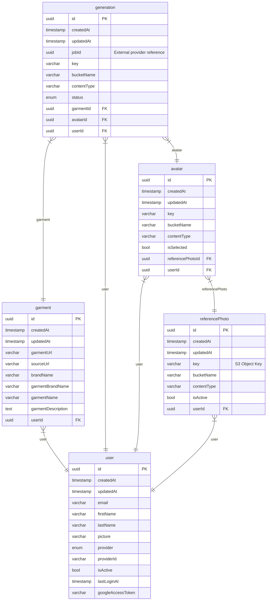

# Lyo Server

## Database ERD

```mermaid
erDiagram
  garment {
    uuid id PK
    timestamp createdAt
    timestamp updatedAt
    varchar garmentUrl
    varchar sourceUrl
    varchar brandName
    varchar garmentBrandName
    varchar garmentName
    text garmentDescription
    uuid userId FK
  }
  generation {
    uuid id PK
    timestamp createdAt
    timestamp updatedAt
    uuid jobId "External provider reference"
    varchar key
    varchar bucketName
    varchar contentType
    enum status
    uuid garmentId FK
    uuid avatarId FK
    uuid userId FK
  }
  avatar {
    uuid id PK
    timestamp createdAt
    timestamp updatedAt
    varchar key
    varchar bucketName
    varchar contentType
    bool isSelected
    uuid referencePhotoId FK
    uuid userId FK
  }
  referencePhoto {
    uuid id PK
    timestamp createdAt
    timestamp updatedAt
    varchar key "S3 Object Key"
    varchar bucketName
    varchar contentType
    bool isActive
    uuid userId FK
  }
  user {
    uuid id PK
    timestamp createdAt
    timestamp updatedAt
    varchar email
    varchar firstName
    varchar lastName
    varchar picture
    enum provider
    varchar providerId
    bool isActive
    timestamp lastLoginAt
    varchar googleAccessToken
  }
  garment }|--|| user: user
  generation }|--|| garment: garment
  generation }|--|| avatar: avatar
  generation }|--|| user: user
  avatar }|--|| referencePhoto: referencePhoto
  avatar }|--|| user: user
  referencePhoto }|--|| user: user
```
